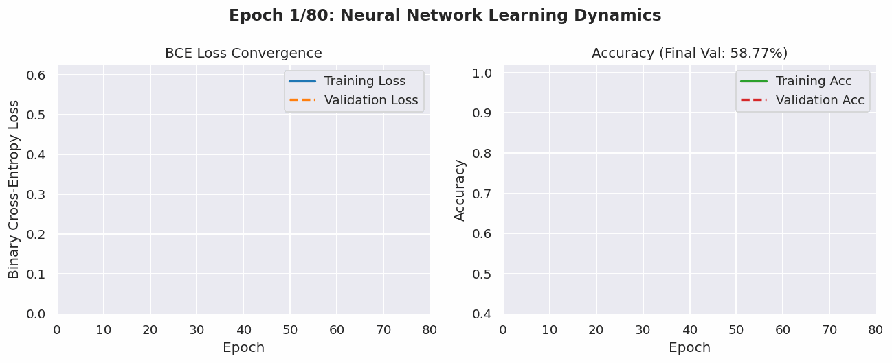
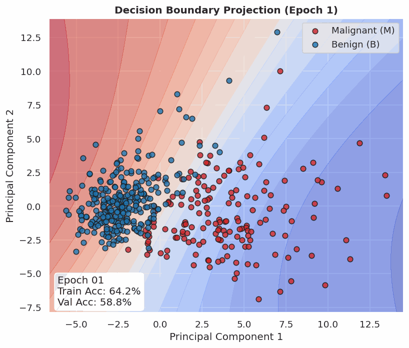
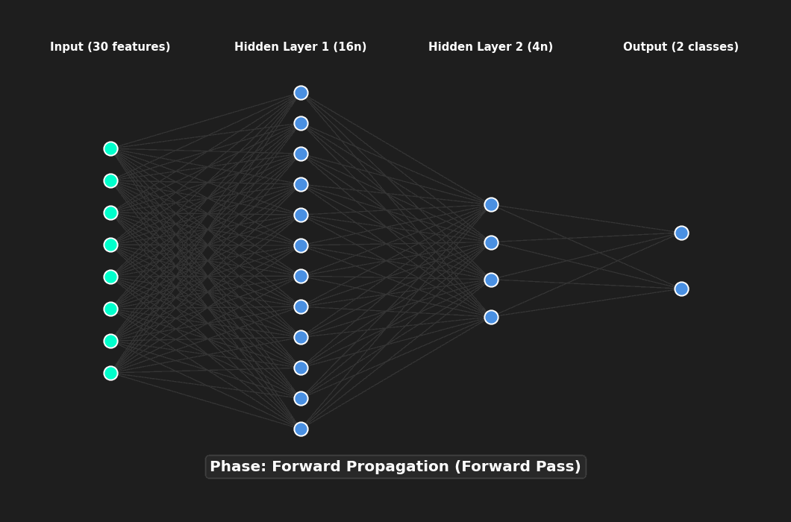

# 🧠 Custom Multilayer Perceptron (MLP) from Scratch

A math-first, highly optimized implementation of a feedforward artificial neural network from scratch using **pure NumPy**. This project is designed as a deep-dive exploration of deep learning fundamentals—unraveling the mathematical mechanics behind forward propagation, backpropagation, and weight optimization without the abstraction of frameworks like PyTorch or TensorFlow.

---

## ⚡ Showcase & Animations

### 1. 📈 Dynamic Loss & Accuracy Convergence
*Watch the live training and validation metrics converge side-by-side epoch-by-epoch. The validation accuracy smoothly climbs as binary cross-entropy loss drops toward zero.*



### 2. 🌀 Decision Boundary warping (PCA Projection)
*This visualization projects the 30-dimensional feature space onto the first two Principal Components (PCA). You can see the neural network's non-linear decision boundary shift, expand, and bend in real time to perfectly isolate Malignant (red) from Benign (blue) samples.*



### 3. 🕸️ Neural Network Signals & Backprop Pulsing
*An animated block-diagram tracing the mechanics of our feedforward and backpropagation cycles. Witness the forward activation flow (green pulses), the Softmax decision boundary classification, and the backpropagating error gradients (crimson pulses) traversing the weights.*



---

## 📐 Network Architecture

The architecture consists of a **fully connected multilayer perceptron** structured as a `[30 -> 16 -> 4 -> 2]` network:

```
  Input Features         Hidden Layer 1          Hidden Layer 2        Output Probabilities
    [30 nodes]             [16 nodes]               [4 nodes]                [2 nodes]
  
   ┌──────────┐           ┌──────────┐            ┌──────────┐             ┌───────────┐\n   │ Feature1 ├───\       │  Node 1  │───\        │  Node 1  │───\         │ Malignant │\n   ├──────────┤    \      ├──────────┤    \       ├──────────┤    \        │ (Softmax) │\n   │ Feature2 ├─────┼────>│  Node 2  ├─────┼─────>│  Node 2  ├─────┼──────>├───────────┤\n   ├──────────┤    /      ├──────────┤    /       ├──────────┤    /        │  Benign   │\n   │   ...    ├───/       │   ...    ├───/        │   ...    ├───/         │ (Softmax) │\n   ├──────────┤           ├──────────┤            ├──────────┤             └───────────┘\n   │Feature30 │           │ Node 16  │            │  Node 4  │\n   └──────────┘           └──────────┘            └──────────┘\n```

* **Input Layer (30 nodes):** Coordinates correspond to the 30 standardized features of the cell nuclei extracted from breast cancer biopsy images.
* **Hidden Layer 1 (16 neurons):** Sigmoid activation function. Initialized with scaled normal weights ($1/\sqrt{30}$).
* **Hidden Layer 2 (4 neurons):** Sigmoid activation function. Initialized with scaled normal weights ($1/\sqrt{16}$).
* **Output Layer (2 nodes):** Softmax activation function. Outputs probabilities for two distinct classes: $P(\text{Malignant})$ and $P(\text{Benign})$.

---

## 🔬 Mathematical Implementation Details

### 1. Robust Feature Normalization
To prevent numerical instability and scale imbalances across the 30 dimensions, the training data is standardized:
$$X_{\text{norm}} = \frac{X - \mu}{\sigma}$$
*The calculated mean ($\mu$) and standard deviation ($\sigma$) are saved dynamically as `mean.npy` and `std.npy` to guarantee identical preprocessing scales for incoming prediction datasets.*

### 2. Forward Propagation & Activations
At each layer $l$, the pre-activation $z^{(l)}$ is calculated as:
$$z^{(l)} = W^{(l)} a^{(l-1)} + b^{(l)}$$

The hidden layers employ the **Sigmoid** activation function:
$$\sigma(z) = \frac{1}{1 + e^{-z}}$$

The final output layer maps logits into probability space using the stable **Softmax** function:
$$a_i^{(3)} = \frac{e^{z_i^{(3)} - \max(z^{(3)})}}{\sum_{j} e^{z_j^{(3)} - \max(z^{(3)})}}$$
*Subtracting the maximum of the logit vector protects the calculation from catastrophic floating-point overflow.*

### 3. Cross-Entropy Loss
For a binary target $y \in \{0, 1\}$ represented across two output nodes:
$$\mathcal{L} = - \Big( y \log(a_0^{(3)}) + (1 - y) \log(a_1^{(3)}) \Big)$$

### 4. Backpropagation Gradients (The Chain Rule)
The network optimizes its weight tensors using stochastic gradient descent (SGD). The error gradients with respect to pre-activations are derived sequentially backward:

* **Output Layer Logits ($z^{(3)}$):**
  $$\delta^{(3)} = a^{(3)} - y = \begin{bmatrix} P(\text{Malignant}) - y \\ P(\text{Benign}) - (1 - y) \end{bmatrix}$$
* **Hidden Layers ($z^{(l)}$):**
  $$\delta^{(l)} = \Big( (W^{(l+1)})^T \delta^{(l+1)} \Big) \odot \big( a^{(l)} \odot (1 - a^{(l)}) \big)$$

Weight and bias adjustments are subsequently applied using the learning rate $\eta$:
$$W^{(l)} \leftarrow W^{(l)} - \eta \, (\delta^{(l)} \otimes a^{(l-1)})$$
$$b^{(l)} \leftarrow b^{(l)} - \eta \, \delta^{(l)}$$

---

## 🛠️ Setup & Installation

Clone the repository and install the lightweight NumPy and Matplotlib dependencies:

```bash
git clone https://github.com/RadiantVixen/Multilayer-Perceptron.git
cd Multilayer-Perceptron
python3 -m pip install -r requirements.txt
```

---

## 🚀 Execution & Command Guide

### 1. Training the Perceptron
Launch the parser in training mode to split, standardize, and train the neural network over the specified epochs.

```bash
python3 Parse.py train data.csv
```
* **Output:**
  * Displays loss and validation accuracy per epoch.
  * Exports `mean.npy` and `std.npy` for pre-processing.
  * Records optimal weights to `parameters.json`.
  * Generates the static curve representation as `learning_curves.png`.

### 2. Generating custom GIF Animations
The custom scripts will automatically output these animations to your output directory if desired:
```bash
python3 generate_gifs.py
```

### 3. Evaluating & Predicting
Run inference on any dataset using the pre-saved training configurations:

```bash
python3 Parse.py predict data.csv
```
* **Output:**
  * Outputs the classification of each record (`M` or `B`).
  * Calculates final binary cross-entropy loss and model accuracy.

---

## 📂 Deliverables & Project Manifest

* **`Parse.py`**: Handles CSV parsing, stochastic splitting, standardized preprocessing, and interfaces user modes.
* **`train.py`**: Houses the core backpropagation loops, weight initializations, and activation derivatives.
* **`predict.py`**: Loads weights from JSON and applies the feedforward pass to evaluate predictions.
* **`parameters.json`**: Persisted dictionary containing trained weight matrices and bias vectors.
* **`mean.npy` & `std.npy`**: Serialized normalization vectors.
* **`learning_curves.gif`**: Smooth training trajectory GIF.
* **`decision_boundary.gif`**: Visual 2D classification warping GIF.
* **`network_activations.gif`**: Schematic activation flow pulse GIF.
